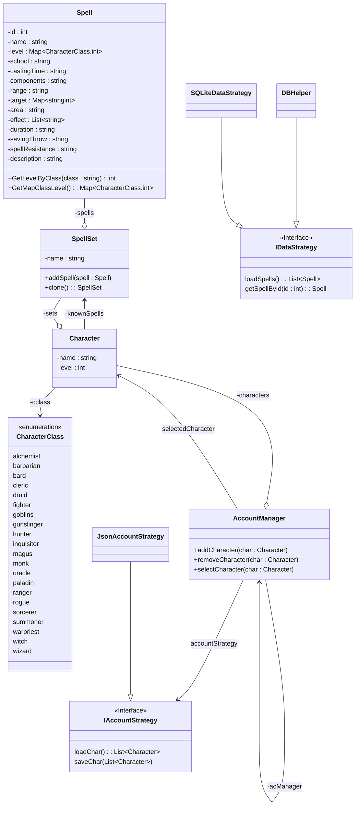
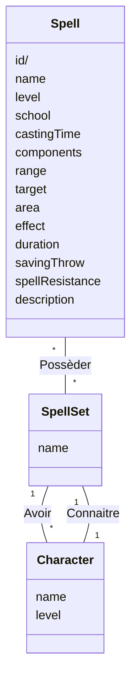

   

# **SPELLTASTIC**

## Bonjour et bienvenue sur le dépôt du projet SpellTastic ! 👋

*******

Sommaire 
 1. [Accessibilité](#acces)
 2. [Progression](#progression)
 3. [Présentation du projet](#presentation)
 4. [Contenu](#contenu)
 5. [Conception](#conception)
 6. [Auteurs](#auteurs)

*******

### Profiter dès maintenant d'un accès anticipé à SpellTastic

         

> **Warning**: Le déploiement n'a pas encore été fait. 

*******

🚧  __EN PROGRESSION__

📆  _Fin du projet prévue :_ 03 Avril 2023

Retrouver notre avancée journalière dans la partie `wiki` de notre dépôt.   

*******

### **Présentation**

SpellTastic : votre compagnon de gestion de sorts pour le jeu de rôle Pathfinder !      
 
Application multi-plateforme vous assistant durant vos parties.

*******

## Fonctionnalités

- Lire des données réelles (liste de sort). Plusieurs solutions sont possibles.   
- Faire des recherches multicritères dans les listes de sort (Par classe, niveau, école, description...).   
- Gérer la progression du personnage. Chaque personnage a un niveau courant. Chaque niveau de classe donne accès à un certain nombre de sorts quotidien par niveau de sort.   
- Prévoir l'anticipation du changement de niveau et préparant ses listes à l'avance.   
- Gérer de multiples personnages.   

- D'autres fonctionnalités supplémentaires sont aussi envisagées

*******

## Ressources

- Temps
    - 23 Janvier au 03 Avril    
- Matériel
    - Ordinateurs portables sous Linux ou Windows   
    - Visual Studio Code    
- Langages utilisés
    -  
    -  
    -  

- Personnes 
    - 4 étudiants en BUT Informatique

*******

## Détails de conception

> **Warning**: En Cours ...

### **Diagramme de classe**

```mermaid
classDiagram

    Spell --o SpellSet : -spells
    SpellSet <-- Character : -knownSpells
    SpellSet --o Character : -sets
    Character --> CharacterClass : -cclass
    AccountManager --> AccountManager : -acManager  
    Character --o AccountManager : -characters
    class Spell{
        -id : int
        -name : string
        -level : Map~CharacterClass.int~
        -school : string
        -castingTime : string
        -components : string
        -range : string
        -target : Map~stringint~
        -area : string
        -effect : List~string~
        -duration : string
        -savingThrow : string
        -spellResistance : string
        -description : string
        +GetLevelByClass(class : string):int
        +GetMapClassLevel() : Map~CharacterClass.int~
    }
    class SpellSet{
        -name : string
        +addSpell(spell : Spell)
        +clone() : SpellSet
    }
    class Character{
        -name : string
        -level : int
    }

    AccountManager --> IAccountStrategy : accountStrategy
    AccountManager --> Character : selectedCharacter

    class AccountManager{
        
        +addCharacter(char : Character)
        +removeCharacter(char : Character)
        +selectCharacter(char : Character)
    }
    class CharacterClass{
        <<enumeration>>
        alchemist
        barbarian
        bard
        cleric
        druid
        fighter
        goblins
        gunslinger
        hunter
        inquisitor
        magus
        monk
        oracle
        paladin
        ranger
        rogue
        sorcerer
        summoner
        warpriest
        witch
        wizard
    }

    DBHelper --|> IDataStrategy
    SQLiteDataStrategy --|> IDataStrategy

    class IDataStrategy {
        <<Interface>>
        loadSpells() : List~Spell~
        getSpellById(id : int) : Spell
    }

    JsonAccountStrategy --|> IAccountStrategy

    class IAccountStrategy{
        <<Interface>>
        loadChar() : List~Character~
        saveChar(List~Character~)
    }

    
```

### MCD : Modèle Conceptuel de Données

```mermaid
classDiagram

    Spell "*" -- "*" SpellSet : Possèder
    SpellSet "1" -- "*" Character : Avoir
    SpellSet "1" -- "1" Character : Connaitre

    class Spell{
        id/
        name
        level
        school
        castingTime
        components
        range
        target
        area
        effect
        duration
        savingThrow
        spellResistance
        description
        }
    class SpellSet{
        name
    }
    class Character{
        name
        level
    }
```
### MLD : Modèle Logique de Données

Spell(<ins>id</ins>,name,description,reference,source,school,level,castingTime,components,range,target,duration);  
SpellSet(<ins>name</ins>,#charName);  
Character(<ins>name</ins>,level);  
Posséder(<ins>#nameSet</ins>,<ins>#idSpell</ins>);  
Connaitre(<ins>#nameChar</ins>,<ins>#idSpell</ins>);  

*******

## Auteurs

Étudiant 2ème Annnée - BUT Informatique - IUT Clermont Auvergne - 2022-2023   
`BRODA Lou` - `FERREIRA Pierre` - `FRANCO Nicolas` - `RICHARD Corentin`

## Instalation Flutter 

### Linux (manually)
___
### Windows
_To install flutter on windows simply follow the steps at: https://docs.flutter.dev/get-started/install/windows_

#### Edit your path variable
Once you've installed flutter you'll have to edit your path variabe to be able to run the `flutter` command from anywhere you want.

You can do that through the Powershell using the command `setx /M PATH "$($env:path);c:path\to\flutter\bin"`  

You can also do that through windows settings GUI:  
* First search for `env` on your windows start menu
* Next go to `Environment variables` at the bottom
* In the user variables section chose the `Path` variable and then click in `edit`
* In the edit menu click `add new`, then input the path to your `flutter\bin` directory

You should now be able to run the `flutter`. To test, you can try running the `flutter doctor` command on a terminal. 
